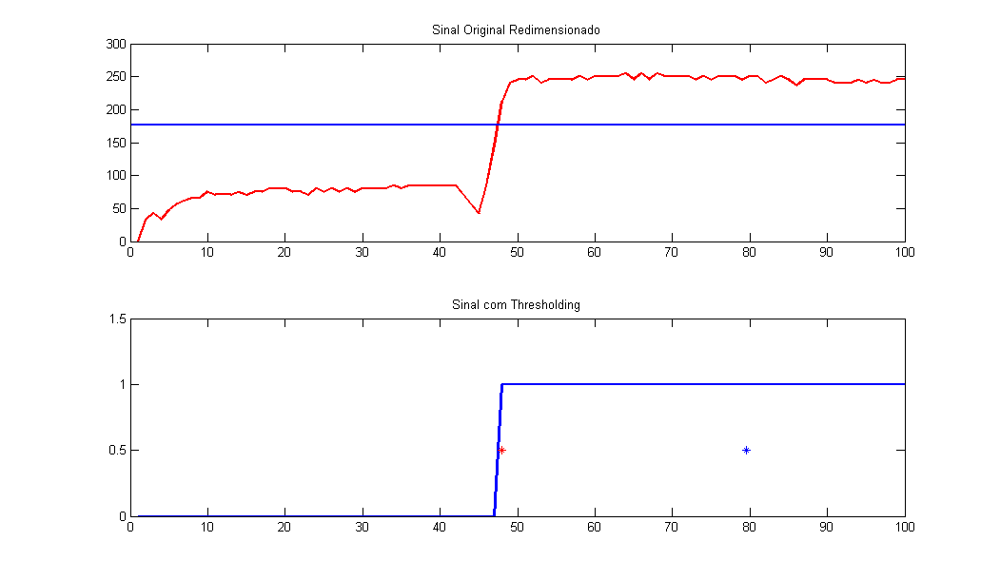

# Uranium Team

Source code Uranium Team from Freescale Cup Brazil 2014

## Require

- CodeWarrior for MCU 10.6
- Freedom Board (Freescale Processor Kinetis KL25Z)
- FRDM-TFC Board
- Linescan Sensor

# Some plot with MATLAB

